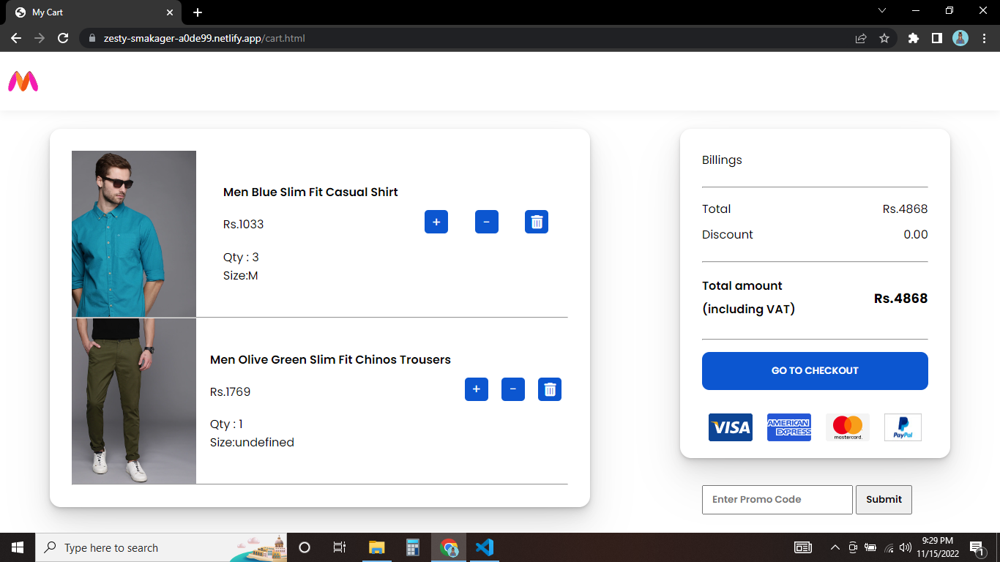

# Myntra Fashion Clone
An Individual project construct week project set out to clone an e-commerce Indian fashion retail webite: Myntra Fashion
Myntra is a major Indian fashion e-commerce company headquartered in Bengaluru, Karnataka, India. Which is an Online Shopping Site for Fashion & Lifestyle in India.

## Tech Stack
- HTML5
- CSS3
- JavaScript

## Features
- ### Landing page
 - 

  
  
  

- ### Mens page
- 

  
  
  

 - ### Womens page
- 

  
  
  

 - ### Kids page
- 

  
  
  

 - ### Mens Single page
- 

  
  
  

 - ### Wishlist page
- 

  
  
  

 - ### Cart page
- 

  
  
  

 - ### Payments Page
- 

  
  
  